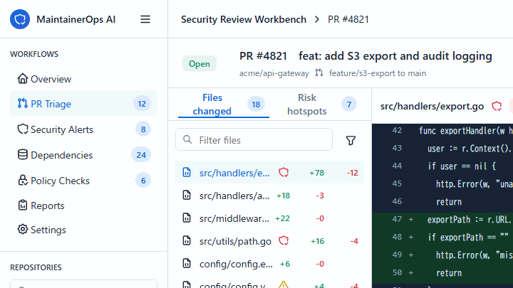

# MaintainerOps AI

[](https://www.npmjs.com/package/maintainerops-ai)
[](https://www.npmjs.com/package/maintainerops-ai)

MaintainerOps AI is a GitHub-aware CLI and GitHub Action for open-source maintainers. It turns pull requests, issues, and fixture-based security or release inputs into structured review packets that a maintainer can accept, edit, or ignore.

OSS ecosystems rely on a small number of maintainers making high-quality decisions under constant backlog pressure. MaintainerOps AI makes that work easier to audit and repeat: it converts noisy issues, PRs, dependency updates, and release tasks into review packets that preserve maintainer control while improving security, code quality, and response time.

The project is intentionally human-in-the-loop. It does not merge pull requests, close issues, publish releases, or run security scans against repositories you do not own or administer.

## Current evidence snapshot

- Public npm package: [`maintainerops-ai`](https://www.npmjs.com/package/maintainerops-ai), latest `v0.1.5`.
- GitHub Marketplace Action: [`MaintainerOps AI`](https://github.com/marketplace/actions/maintainerops-ai), latest `v0.1.6`.
- GitHub releases: `v0.1.0`, `v0.1.1`, `v0.1.2`, `v0.1.3`, `v0.1.4`, `v0.1.5`, and `v0.1.6`.
- Security evidence: initial Codex Security report, fix report, focused rescan, and full repository-wide rescan.
- Workflow evidence: successful manual, pull-request-triggered, and issue-triggered GitHub Actions runs, including the `v0.1.4` hardening PR and post-application maintenance checks.
- Maintainer workflow evidence: issues #1-#4 triaged and closed, issue #6 open for Marketplace/external maintainer feedback, issue #11 tracks the `v0.1.4` hardening release, and real repository review packets published.
- Verification gate: `npm run verify` includes typecheck, lint, format, unit tests, UI smoke test, evals, package dry run, publint, and npm audit.

## Why this exists

Open-source maintenance work is repetitive and high-stakes:

- Review pull requests for risk, test gaps, and security-sensitive changes.
- Triage issues into actionable labels and missing-information requests.
- Summarize dependency, CodeQL, Semgrep, and package audit output when maintainers provide those findings through issues or fixtures.
- Draft release notes from merged pull requests and breaking changes.

MaintainerOps AI uses the OpenAI API to reduce the reading and drafting load while keeping maintainers in control.

## Quick start

Install from npm:

```bash
npm install -g maintainerops-ai
maintainerops analyze --fixture examples/fixtures/pull_request.json --format markdown --offline
```

Run from source:

```bash
npm install
npm run build
npm run demo
```

Full local verification:

```bash
npm run verify
```

With the OpenAI API enabled:

```bash
set OPENAI_API_KEY=<your-openai-api-key>
set OPENAI_MODEL=<supported-openai-model>
npm run build
node dist/cli.js analyze --fixture examples/fixtures/pull_request.json --format markdown
```

If `OPENAI_MODEL` is omitted, the CLI uses its built-in default model. Set the variable explicitly when your organization has standardized on a specific supported OpenAI model.

Against GitHub:

```bash
set GITHUB_TOKEN=<your-github-token>
node dist/cli.js analyze --repo owner/project --pull 123 --authorized --format markdown
node dist/cli.js analyze --repo owner/project --issue 456 --authorized --format json
```

If `OPENAI_API_KEY` is not set, the CLI falls back to deterministic offline heuristics so maintainers can test the workflow without spending credits.

## What the AI returns

The model is asked to return a strict structured object:

- `summary`: maintainer-ready summary
- `riskLevel`: `low`, `medium`, `high`, or `critical`
- `labels`: suggested labels
- `recommendedAction`: next maintainer action
- `reviewChecklist`: concrete review checks
- `securityNotes`: security-sensitive observations
- `releaseNotes`: release-note draft fragments
- `commentDraft`: optional GitHub comment draft

## Safety posture

- Dry-run by default.
- Minimal GitHub permissions.
- Secret redaction before model calls and report serialization.
- Live GitHub analysis requires explicit authorization.
- Pull request CI runs in offline/no-secret mode by default.
- GitHub Actions stdout neutralizes workflow-command syntax from untrusted model text.
- No automatic merge, close, release, or external scan.
- Audit-friendly JSON output with redacted work-item content.
- Optional API use; offline mode works for CI validation.

## Dashboard prototype

```bash
npm run dev
```

Open the printed local URL to review the Security Review Workbench UI.



Static preview: [security-review-workbench.png](docs/images/security-review-workbench.png)

## Security review evidence

- [Codex Security scan report](docs/codex-security/report.md)
- [Codex Security HTML report](docs/codex-security/report.html)
- [Focused fix report](docs/codex-security/fix-report.md)
- [Post-fix rescan report](docs/codex-security/rescan-report.md)
- [Full Codex Security rescan report](docs/codex-security/full-rescan-2026-06-11.md)
- [Full Codex Security rescan HTML](docs/codex-security/full-rescan-2026-06-11.html)
- [Publication exposure scan](docs/codex-security/publication-exposure-scan-2026-06-11.md)
- [v0.1.3 Codex Security diff scan](docs/codex-security/v0.1.3-diff-scan-2026-06-11.md)
- [Action hardening Codex Security diff scan](docs/codex-security/action-hardening-diff-scan-2026-06-12.md)
- [Usage log](docs/usage-log.md)
- [Improvement history](docs/improvement-history.md)
- [npm install evidence](docs/npm-install-evidence.md)
- [Publication audit](docs/publication-audit-2026-06-11.md)
- [Real repository review packets](docs/review-packets/README.md)
- [Application answers](docs/application-answers.md)
- [External feedback request](docs/external-feedback-request.md)
- [Operator runbook](docs/operator-runbook.md)
- [v0.1.0 release](https://github.com/rtonf/maintainerops-ai/releases/tag/v0.1.0)
- [v0.1.2 release](https://github.com/rtonf/maintainerops-ai/releases/tag/v0.1.2)
- [v0.1.3 release](https://github.com/rtonf/maintainerops-ai/releases/tag/v0.1.3)
- [v0.1.4 release](https://github.com/rtonf/maintainerops-ai/releases/tag/v0.1.4)
- [v0.1.5 release](https://github.com/rtonf/maintainerops-ai/releases/tag/v0.1.5)
- [v0.1.6 release](https://github.com/rtonf/maintainerops-ai/releases/tag/v0.1.6)
- [npm package](https://www.npmjs.com/package/maintainerops-ai)

## Application materials

- [OpenAI alignment](docs/openai-alignment.md)
- [Evals](EVALS.md)
- [Promotion kit](docs/promotion-kit.md)
- [Japanese promotion plan](docs/promotion-plan-ja.md)
- [Japanese X post drafts](docs/x-post-ja.md)
- [Japanese note article draft](docs/note-article-ja.md)

## GitHub Action

Use MaintainerOps AI as a read-only GitHub Action to generate review packets during pull request and issue triage.

```yaml
name: MaintainerOps AI

on:
  pull_request:
    types: [opened, synchronize, reopened]
  issues:
    types: [opened, edited]

permissions:
  contents: read
  pull-requests: read
  issues: read

jobs:
  review-packet:
    runs-on: ubuntu-latest
    steps:
      - uses: actions/checkout@v6
        with:
          persist-credentials: false
      - uses: rtonf/maintainerops-ai@v0.1.6
        with:
          mode: ${{ github.event_name == 'pull_request' && 'pull_request' || 'issue' }}
          repo: ${{ github.repository }}
          number: ${{ github.event.pull_request.number || github.event.issue.number }}
          format: markdown
          offline: true
          authorized: true
```

Trying this from GitHub Marketplace? Please leave early maintainer feedback on [Issue #6](https://github.com/rtonf/maintainerops-ai/issues/6) after running either the Action or the npm CLI.

Marketplace listing summary:

> MaintainerOps AI helps open-source maintainers turn pull requests and issues into human-reviewed triage packets with risk level, labels, review checklist, security notes, release-note hints, and a draft response. It is read-only by design, requires explicit authorization for live repository analysis, and does not merge, close, label, or publish anything automatically.

See [action.yml](action.yml), [Marketplace listing notes](docs/github-marketplace.md), and the safe no-secret pull request workflow example at [docs/github-workflows/maintainerops.yml](docs/github-workflows/maintainerops.yml).

## OpenAI alignment

This project is designed for the exact OSS maintenance workflows that the Codex for Open Source program describes: pull request review, issue triage, release workflows, maintainer automation, and security/code-quality support.
