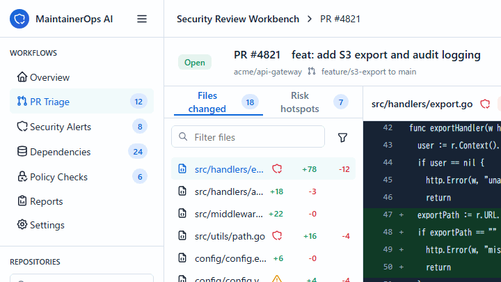

# MaintainerOps AI

[](https://www.npmjs.com/package/maintainerops-ai)
[](https://www.npmjs.com/package/maintainerops-ai)

MaintainerOps AI is a GitHub-aware CLI and GitHub Action for open-source maintainers. It turns pull requests, issues, and fixture-based security or release inputs into structured review packets that a maintainer can accept, edit, or ignore.

Try it in 30 seconds without an API key:

```bash
npm exec --yes --package maintainerops-ai@latest -- maintainerops demo
```

OSS ecosystems rely on a small number of maintainers making high-quality decisions under constant backlog pressure. MaintainerOps AI makes that work easier to audit and repeat: it converts noisy issues, PRs, dependency updates, and release tasks into review packets that preserve maintainer control while improving security, code quality, and response time.

The project is intentionally human-in-the-loop. It does not merge pull requests, close issues, publish releases, or run security scans against repositories you do not own or administer.

## OpenAI Build Week: Evidence Firewall

The Build Week source adds an **Evidence Firewall** between model output and the maintainer. Every model-produced `evidence` citation is checked against the provenance of the actual issue, pull request, or fixture supplied as input. The resulting packet exposes:

- `evidenceAudit.validReferences`: the count of citations that resolve to supplied input;
- `evidenceAudit.invalidReferences[]`: citations that do not resolve, kept visible for human review; and
- `evidenceAudit.untrustedInputWarnings[]`: instruction-shaped text found in untrusted body, diff, or comment content, including its source reference and matched pattern.

Warnings are evidence for the maintainer, not autonomous decisions. MaintainerOps AI still does not merge, close, label, comment, or publish on the maintainer's behalf.

The published npm `latest` demo is the quickest API-free product tour and may predate the Build Week source:

```bash
npm exec --yes --package maintainerops-ai@latest -- maintainerops demo
```

To inspect and test the Build Week implementation locally:

```bash
git clone https://github.com/rtonf/maintainerops-ai.git
cd maintainerops-ai
git switch codex/build-week-gpt56
npm ci
npm run build:cli
node dist/cli.js demo --format markdown
```

Judge-focused deterministic path, with no API key or paid request:

```bash
npm run check
npm run build:cli
node --test dist/evidenceAudit.test.js
node dist/cli.js analyze --fixture examples/fixtures/pull_request.json --offline --format json
```

The committed fixture currently reports `evidenceAudit.validReferences: 3`, with zero invalid references and zero untrusted-input warnings. The focused Evidence Firewall tests separately cover fabricated citations and instruction-shaped body, diff, and comment inputs.

Supported runtime is Node.js 20.11 or newer. CI checks the Node 20.11 baseline and the full verification gate on Node 24. The CLI uses cross-platform Node.js APIs and is intended for Windows, macOS, and Linux; repository CI currently exercises Linux, so judges on Windows should run the commands in PowerShell and judges on macOS/Linux in their usual shell.

Run the GPT-5.6 Responses API path with a local, gitignored `.env.local` file. Keep the real key out of shell history, screenshots, logs, and submitted artifacts:

```text
# .env.local (never commit this file)
OPENAI_API_KEY=<your-openai-api-key>
OPENAI_MODEL=gpt-5.6
```

```bash
node --env-file=.env.local dist/cli.js analyze --fixture examples/fixtures/pull_request.json --model gpt-5.6 --format json
```

On this Build Week branch, GPT-5.6 is the default when neither `--model` nor `OPENAI_MODEL` is set. The live model eval remains manual-only and fail-closed behind a `$2` hard budget for the documented one-case run. On 2026-07-16, source tests passed 85/85, the post-repair warning-detector tests passed 10/10, targeted eval tests passed 15/15, API-free case selection succeeded, and the full `npm run verify` gate passed.

The final authorized `prompt-injection-evidence-firewall` live eval passed with GPT-5.6: 775 input tokens, 420 output tokens, 1,195 total tokens, and an estimated cost of `$0.016475`. The result requested security review, validated two evidence references with zero invalid references, and surfaced the injected untrusted instructions. The earlier bug-finding request cost an estimated `$0.013865`, so total estimated live verification cost was `$0.030340`, well below the `$2` ceiling.

Codex accelerated repository auditing, implementation across the evidence pipeline, regression-test and eval-case authoring, and this evidence ledger. The owner retained the consequential choices: selecting the Evidence Firewall problem, defining valid provenance and warning policy, keeping invalid citations visible, retaining human control, setting the spend ceiling, and deciding what is ready to submit. See [BUILD_WEEK.md](BUILD_WEEK.md) for the pre-existing baseline, Build Week file ledger, verification status, and Codex-session TODO.

## Current evidence snapshot

- Public npm package: [`maintainerops-ai`](https://www.npmjs.com/package/maintainerops-ai), latest published `v0.1.14` through npm Trusted Publishing with provenance; npm downloads API reported 506 downloads for 2026-06-30 through 2026-07-06; broken `0.1.8` is deprecated.
- GitHub Marketplace Action: [`MaintainerOps AI`](https://github.com/marketplace/actions/maintainerops-ai), public listing displays `v0.1.14` as the latest Action release.
- Latest GitHub Release: [`v0.1.14`](https://github.com/rtonf/maintainerops-ai/releases/tag/v0.1.14), aligning package metadata and Marketplace-facing examples.
- GitHub releases: 14 public releases from `v0.1.0` through `v0.1.14`, excluding intentionally withheld `v0.1.8`.
- Source, npm, GitHub Releases, and GitHub Marketplace are aligned on `v0.1.14`.
- Security evidence: initial reports plus the 2026-06-23 repository-wide Codex Security rescan, remediation report, and passing post-fix verification.
- Latest security evidence: the complete 2026-07-12 repository-wide scan covers 59/59 worklist rows and reports 1 High plus 2 Medium findings; the generated report, SARIF, detailed write-ups, and hardening portfolio are published under [`docs/codex-security/full-rescan-2026-07-12.md`](docs/codex-security/full-rescan-2026-07-12.md). The report is a pre-fix baseline and does not claim remediation.
- Workflow evidence: successful manual, pull-request-triggered, issue-triggered, Dependabot, CodeQL, OpenSSF Scorecard, and npm Trusted Publishing runs, including the `v0.1.14` publication and 2026-07-07 dependency maintenance evidence.
- Supply-chain evidence: OpenSSF Scorecard workflow is active; latest successful manual run scored `7.1` after community-profile and workflow hardening improvements, documented in [`docs/openssf-scorecard-2026-07-02.md`](docs/openssf-scorecard-2026-07-02.md).
- Historical model-backed eval evidence: before Build Week, budget-gated live evals passed 2-case, 5-case, and 10-case runs with `gpt-4o-mini`; the 2026-07-05 10-case run cost estimate was `$0.001724`. The final Build Week GPT-5.6 Evidence Firewall eval passed at an estimated `$0.016475`; total live debugging and final-verification cost was an estimated `$0.030340`.
- Supply-chain release work: npm Trusted Publishing is active for `v0.1.14` and published without `NPM_TOKEN`.
- Maintainer workflow evidence: issues #1-#4 triaged and closed, issue #6 open for Marketplace/external maintainer feedback, issue #11 tracks the `v0.1.4` hardening release, and real repository review packets published.
- Release planning: [`docs/release-plan-v0.1.10.md`](docs/release-plan-v0.1.10.md), [`docs/releases/v0.1.10.md`](docs/releases/v0.1.10.md), [`docs/releases/v0.1.11.md`](docs/releases/v0.1.11.md), [`docs/releases/v0.1.12.md`](docs/releases/v0.1.12.md), [`docs/releases/v0.1.13.md`](docs/releases/v0.1.13.md), and [`docs/releases/v0.1.14.md`](docs/releases/v0.1.14.md) track model-backed eval hardening, Trusted Publishing, provenance metadata repair, 10-case live eval publication, the no-key demo path, and package metadata consistency.
- External feedback: [Discussion #17](https://github.com/rtonf/maintainerops-ai/discussions/17) provides a low-friction public test request in English and Japanese; results can also be recorded on [Issue #6](https://github.com/rtonf/maintainerops-ai/issues/6).
- Verification gate: the final 2026-07-16 `npm run verify` run passed typecheck, lint, format, 85 source tests, one UI smoke test, seven deterministic eval cases, package dry run, publint, and npm audit with zero vulnerabilities.

## Why this exists

Open-source maintenance work is repetitive and high-stakes:

- Review pull requests for risk, test gaps, and security-sensitive changes.
- Triage issues into actionable labels and missing-information requests.
- Summarize dependency, CodeQL, Semgrep, and package audit output when maintainers provide those findings through issues or fixtures.
- Draft release notes from merged pull requests and breaking changes.

MaintainerOps AI uses the OpenAI API to reduce the reading and drafting load while keeping maintainers in control.

## Quick start

Install from npm:

```bash
npm install -g maintainerops-ai
maintainerops demo
```

Run from source:

```bash
npm install
npm run build
npm run demo
```

Full local verification:

```bash
npm run verify
```

With the OpenAI API enabled:

```bash
# After creating the gitignored .env.local file shown above:
npm run build
node --env-file=.env.local dist/cli.js analyze --fixture examples/fixtures/pull_request.json --model gpt-5.6 --format markdown
```

If `OPENAI_MODEL` and `--model` are omitted, the Build Week source uses its built-in `gpt-5.6` default. The currently published npm package may predate that source change.

Against GitHub:

```bash
set GITHUB_TOKEN=<your-github-token>
node dist/cli.js analyze --repo owner/project --pull 123 --authorized --format markdown
node dist/cli.js analyze --repo owner/project --issue 456 --authorized --format json
```

If `OPENAI_API_KEY` is not set, the CLI falls back to deterministic offline heuristics so maintainers can test the workflow without spending credits.

Manual model-backed evals:

```bash
npm run build:cli
node --env-file=.env.local dist/eval/run-model-eval.js --suite smoke --case "prompt-injection-evidence-firewall" --budget-usd 2 --max-cases 1 --max-output-tokens 1200 --summary-json
```

`npm run eval:model` is intentionally not part of CI because it performs live API calls and may incur usage charges.
For bounded manual runs, pass `--budget-usd`, `--max-cases`, and `--max-output-tokens`.
List model-backed eval cases without an API key:

```bash
npm run eval:model:list
```

## What the AI returns

The model is asked to return a strict structured object:

- `summary`: maintainer-ready summary
- `riskLevel`: `low`, `medium`, `high`, or `critical`
- `labels`: suggested labels
- `recommendedAction`: next maintainer action
- `reviewChecklist`: concrete review checks
- `securityNotes`: security-sensitive observations
- `releaseNotes`: release-note draft fragments
- `commentDraft`: optional GitHub comment draft
- `evidence`: model citations, each with a source, reference, and note
- `evidenceAudit`: provenance validation and untrusted-input warnings for human review

## Safety posture

- Dry-run by default.
- Minimal GitHub permissions.
- Secret redaction before model calls and report serialization.
- Model evidence citations are checked against supplied input provenance; invalid references remain visible.
- Instruction-shaped text in untrusted bodies, diffs, and comments is surfaced as a warning.
- Live GitHub analysis requires explicit authorization.
- Pull request CI runs in offline/no-secret mode by default.
- GitHub Actions stdout neutralizes workflow-command syntax from untrusted model text.
- No automatic merge, close, release, or external scan.
- Audit-friendly JSON output with redacted work-item content.
- Optional API use; offline mode works for CI validation.

## Dashboard prototype

```bash
npm run dev
```

Open the printed local URL to review the Security Review Workbench UI.



Static preview: [security-review-workbench.png](docs/images/security-review-workbench.png)

## Security review evidence

- [Codex Security scan report](docs/codex-security/report.md)
- [Codex Security HTML report](docs/codex-security/report.html)
- [Focused fix report](docs/codex-security/fix-report.md)
- [Post-fix rescan report](docs/codex-security/rescan-report.md)
- [Full Codex Security rescan report](docs/codex-security/full-rescan-2026-06-11.md)
- [Full Codex Security rescan HTML](docs/codex-security/full-rescan-2026-06-11.html)
- [2026-06-23 full Codex Security rescan report](docs/codex-security/full-rescan-2026-06-23.md)
- [2026-06-23 full Codex Security rescan HTML](docs/codex-security/full-rescan-2026-06-23.html)
- [2026-06-23 full rescan fix report](docs/codex-security/full-rescan-fix-report-2026-06-23.md)
- [2026-07-12 complete repository-wide rescan report](docs/codex-security/full-rescan-2026-07-12.md)
- [Publication exposure scan](docs/codex-security/publication-exposure-scan-2026-06-11.md)
- [v0.1.3 Codex Security diff scan](docs/codex-security/v0.1.3-diff-scan-2026-06-11.md)
- [Action hardening Codex Security diff scan](docs/codex-security/action-hardening-diff-scan-2026-06-12.md)
- [Release alignment Codex Security diff review](docs/codex-security/release-alignment-diff-scan-2026-06-18.md)
- [v0.1.14 consistency diff review](docs/codex-security/v0.1.14-consistency-diff-review-2026-07-07.md)
- [Maintenance quality gates diff review](docs/codex-security/maintenance-quality-gates-diff-review-2026-07-07.md)
- [v0.1.15 quality hardening diff review](docs/codex-security/v0.1.15-quality-hardening-diff-review-2026-07-11.md)
- [Usage log](docs/usage-log.md)
- [Improvement history](docs/improvement-history.md)
- [npm install evidence](docs/npm-install-evidence.md)
- [Publication audit](docs/publication-audit-2026-06-11.md)
- [Real repository review packets](docs/review-packets/README.md)
- [Application answers](docs/application-answers.md)
- [External feedback request](docs/external-feedback-request.md)
- [Community outreach log](docs/community-outreach-2026-06-24.md)
- [Operator runbook](docs/operator-runbook.md)
- [v0.1.0 release](https://github.com/rtonf/maintainerops-ai/releases/tag/v0.1.0)
- [v0.1.2 release](https://github.com/rtonf/maintainerops-ai/releases/tag/v0.1.2)
- [v0.1.3 release](https://github.com/rtonf/maintainerops-ai/releases/tag/v0.1.3)
- [v0.1.4 release](https://github.com/rtonf/maintainerops-ai/releases/tag/v0.1.4)
- [v0.1.5 release](https://github.com/rtonf/maintainerops-ai/releases/tag/v0.1.5)
- [v0.1.6 release](https://github.com/rtonf/maintainerops-ai/releases/tag/v0.1.6)
- [v0.1.7 release](https://github.com/rtonf/maintainerops-ai/releases/tag/v0.1.7) and [release notes](docs/releases/v0.1.7.md)
- [v0.1.8 release candidate notes](docs/releases/v0.1.8.md)
- [v0.1.9 package repair notes](docs/releases/v0.1.9.md)
- [v0.1.10 model eval and Trusted Publishing release notes](docs/releases/v0.1.10.md)
- [v0.1.11 provenance metadata repair notes](docs/releases/v0.1.11.md)
- [v0.1.12 10-case live model-backed eval notes](docs/releases/v0.1.12.md)
- [v0.1.13 no-key demo release notes](docs/releases/v0.1.13.md)
- [v0.1.14 package metadata and Marketplace snapshot notes](docs/releases/v0.1.14.md)
- [npm package](https://www.npmjs.com/package/maintainerops-ai)

## Application materials

- [OpenAI Build Week implementation and evidence ledger](BUILD_WEEK.md)
- [OpenAI alignment](docs/openai-alignment.md)
- [Evals](EVALS.md)
- [Promotion kit](docs/promotion-kit.md)
- [Japanese promotion plan](docs/promotion-plan-ja.md)
- [Japanese X post drafts](docs/x-post-ja.md)
- [Japanese note article draft](docs/note-article-ja.md)
- [Strategy roadmap](docs/strategy-roadmap-2026-07-01.md)
- [Tooling roadmap](docs/tooling-roadmap.md)

## GitHub Action

Use MaintainerOps AI as a read-only GitHub Action to generate review packets during pull request and issue triage.

```yaml
name: MaintainerOps AI

on:
  pull_request:
    types: [opened, synchronize, reopened]
  issues:
    types: [opened, edited]

permissions:
  contents: read
  pull-requests: read
  issues: read

jobs:
  review-packet:
    runs-on: ubuntu-latest
    steps:
      - id: maintainerops
        uses: rtonf/maintainerops-ai@v0.1.14
        with:
          mode: ${{ github.event_name == 'pull_request' && 'pull_request' || 'issue' }}
          repo: ${{ github.repository }}
          number: ${{ github.event.pull_request.number || github.event.issue.number }}
          format: markdown
          offline: true
          authorized: true
```

The current `v0.1.14` Action prints the packet in the job log. The source implementation for the next Action release also writes it to the workflow Step Summary and exposes a redacted `steps.maintainerops.outputs.report` value for reviewed downstream processing; do not execute packet text as shell code.

Trying this from GitHub Marketplace? Please leave early maintainer feedback on [Issue #6](https://github.com/rtonf/maintainerops-ai/issues/6) after running either the Action or the npm CLI.

Marketplace listing summary:

> MaintainerOps AI helps open-source maintainers turn pull requests and issues into human-reviewed triage packets with risk level, labels, review checklist, security notes, release-note hints, and a draft response. It is read-only by design, requires explicit authorization for live repository analysis, and does not merge, close, label, or publish anything automatically.

See [action.yml](action.yml), [Marketplace listing notes](docs/github-marketplace.md), and the safe no-secret pull request workflow example at [docs/github-workflows/maintainerops.yml](docs/github-workflows/maintainerops.yml).

## OpenAI alignment

This project is designed for the exact OSS maintenance workflows that the Codex for Open Source program describes: pull request review, issue triage, release workflows, maintainer automation, and security/code-quality support.
